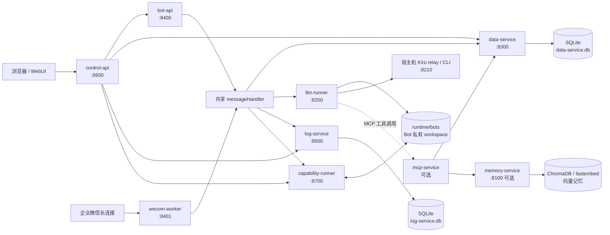
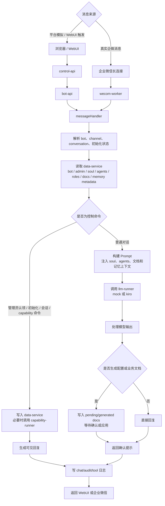
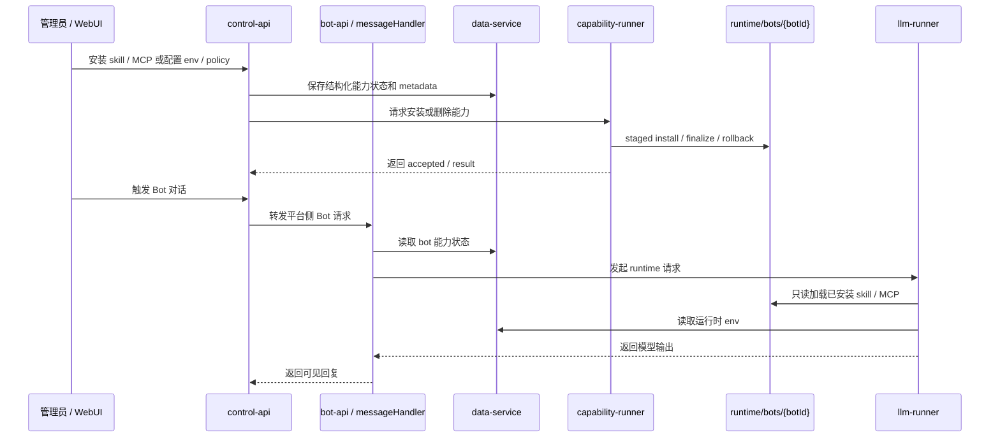
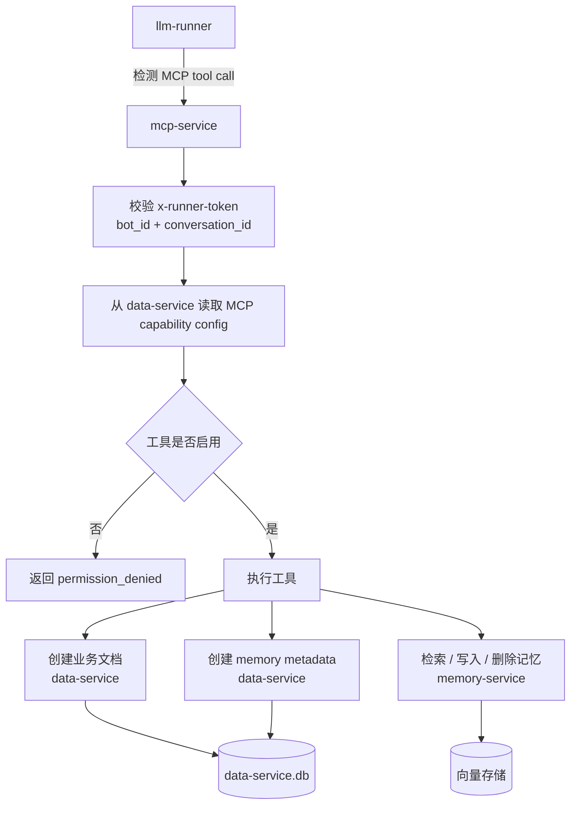
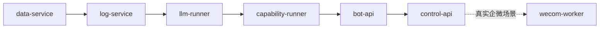

# My Agent Toolkit 架构流程图

本文基于当前仓库结构、`README.md`、`deploy/compose/docker-compose.yml` 和各服务入口代码整理，用于快速理解这个项目的运行链路。

## 项目定位

`my-agent-toolkit` 是一个个人 AI Agent 技能与企业微信 Bot 平台仓库。它包含两类内容：

- `.agents/skills/`：给 Codex/Kiro/Kimi/Claude 等 Agent 使用的技能说明与模板。
- `services/`：企业微信 Bot 平台的多服务实现，包括控制面、消息接入、LLM 执行、状态存储、日志、能力安装和记忆服务。

## 总体服务拓扑



说明：

- 基础 Compose 拓扑包含 `control-api`、`bot-api`、`data-service`、`log-service`、`llm-runner`、`capability-runner`。
- `wecom-worker` 在 `wecom` profile 下单独启动，避免开发环境重复抢占真实企业微信长连接。
- `mcp-service` 和 `memory-service` 是可选的工具/记忆链路，源码已存在，但不在当前基础 Compose 拓扑中。

## 核心消息处理流程



关键点：

- `bot-api` 和 `wecom-worker` 不各自实现一套业务逻辑，而是共享 `services/bot-host/src/messageHandler.ts`。
- 运行状态不保存在接入进程内，关键状态统一进入 `data-service`。
- `llm-runner` 只负责把请求交给具体 runtime，不直接管理 bot 配置或能力安装。

## 控制面流程

```mermaid
flowchart TD
  admin[管理员打开 WebUI] --> control[control-api]

  control --> bots[Bot 管理<br/>创建、编辑、重置管理员]
  control --> roles[角色管理<br/>role.md、role questions]
  control --> docs[文档管理<br/>global docs、role docs、business docs]
  control --> caps[能力管理<br/>env、skills、MCP、policy]

  bots --> data[data-service]
  roles --> data
  docs --> data
  caps --> data
  caps --> cap[capability-runner]

  control --> audit[log-service<br/>记录审计事件]

  cap --> workspace[(runtime/bots/{botId}<br/>私有 workspace)]
  data --> sqlite[(data-service.db)]
```

控制面的职责边界：

- `control-api` 提供页面和管理 API，并把多数结构化状态写入 `data-service`。
- 能力安装/删除由 `capability-runner` 执行，目标是每个 bot 的私有 workspace。
- 环境变量真实值不进入 Prompt、Memory、Soul、Agents 或普通文档，只在 runtime 执行时临时注入。

## Bot 私有能力流程



## MCP 与记忆链路



记忆系统分两层：

- `data-service` 保存业务侧 metadata、文档、memory 记录和统计。
- `memory-service` 负责文本切块、embedding、向量搜索、文件/URL/目录摄取等后端能力。

## 启动顺序



推荐顺序：

1. `data-service`
2. `log-service`
3. `llm-runner`
4. `capability-runner`
5. `bot-api`
6. `control-api`
7. `wecom-worker`，仅在真实企业微信场景启动

基础服务可通过以下命令重建并启动：

```bash
./scripts/dev-redeploy.sh
```

真实企业微信 worker 单独启动：

```bash
docker compose -f deploy/compose/docker-compose.yml --profile wecom up -d wecom-worker
```

## 代码入口速查

- `services/control-api/src/server.ts`：WebUI 和控制面 API。
- `services/bot-host/src/botApiMain.ts`：平台侧 Bot HTTP API 入口。
- `services/bot-host/src/wecomWorkerMain.ts`：企业微信长连接 worker 入口。
- `services/bot-host/src/messageHandler.ts`：共享消息处理、初始化、Prompt 构建、能力命令处理。
- `services/data-service/src/server.ts`：状态中心 API。
- `services/log-service/src/server.ts`：聊天、审计、工具事件日志。
- `services/llm-runner/src/server.ts`：runtime 调用、stream、MCP tool call 续跑。
- `services/capability-runner/src/server.ts`：bot 私有 skill / MCP 安装与删除入口。
- `services/mcp-service/src/server.ts`：可选 MCP 工具服务。
- `services/memory-service/src/main.py`：可选记忆后端服务。
- `packages/contracts/src/`：跨服务共享的请求/响应契约。
