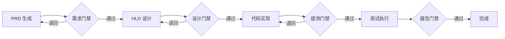
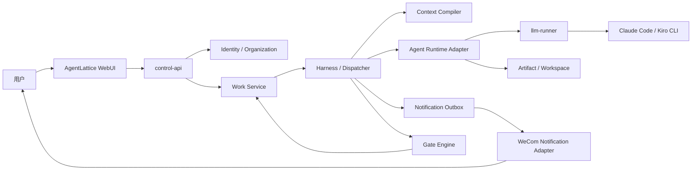

# AgentLattice Foundation Design

## 文档状态

- 项目名称：`AgentLattice`
- 目标分支：`AgentLattice`
- 状态：Draft，等待产品与架构评审
- 日期：2026-07-18
- 文档类型：Foundation Spec

本文定义 AgentLattice 的产品边界、核心领域模型、运行方式、安全原则和 MVP 范围。本文确认前，不进入数据库迁移、跨服务 API 定稿或大规模代码重构。

## 一句话定位

AgentLattice 是一个面向企业多角色协作的 Agent 工作平台：以 WebUI 作为主工作台，通过可配置的 Work Graph、质量门禁、最小上下文交接和隔离的 CLI Runtime，让产品、研发、测试、市场、运营等人员与各自的 Personal Agent 完成跨角色工作流转。

## 背景与问题

当前平台已具备：

- Bot 创建、认领和企业微信长连接
- Bot 级 Rules、Skills、MCP、环境变量和凭证绑定
- Bot、用户和 conversation 维度的 CLI Session 隔离
- Claude Code / Kiro CLI Runtime
- 独立项目工作区、测试执行、报告和 GitHub/Jira 能力
- WebUI 控制面、日志、审计和能力管理

但当前交互仍然以“用户向 Bot 发送一条消息”为中心，无法自然支持以下场景：

- 一名用户同时处理多个相互独立的工作
- PRD、HLD、代码和测试报告在不同人员间有序流转
- 中间 Reviewer 根据质量标准退回或放行产物
- 不同部门按人员、团队或能力动态选择下一负责人
- 接收方只获得必要上下文，而不是全部聊天历史
- 工作到达后自动执行 CLI，不依赖接收人先发送一条消息
- WebUI 中查看独立工作线程、产物、门禁结果和执行状态

继续把这些能力塞进一个企业微信聊天窗口，会引入工作编号、会话切换、引用路由和消息刷屏等复杂交互。因此 AgentLattice 将 WebUI 提升为核心工作界面，企业微信退回通知与轻操作渠道。

## 产品目标

AgentLattice 第一阶段需要实现：

1. 每名用户拥有一个隔离的逻辑 Personal Agent。
2. 每项工作拥有独立页面、阶段、对话、产物和 CLI Workspace。
3. 工作可以由用户明确转交给具体人员，也可以按团队或能力解析负责人。
4. 接收工作后默认自动入队和执行，不要求接收人逐项接受。
5. Reviewer Gate 可以放行、退回或升级人工处理，并提供结构化证据。
6. 跨阶段只传递最小交接包，不直接复制完整聊天记录或模型推理。
7. 用户、部门、团队、能力和工作流均为配置数据，不写死产品、研发、测试等岗位。
8. 企业微信只发送关键通知，并跳转到对应 WebUI 工作页面。
9. 所有工作流转、产物版本、门禁结果和 Runtime 执行均可审计。

## 非目标

MVP 不包含：

- 一名用户拥有多个可见 Personal Agent
- 每名用户创建一个独立企业微信 Bot ID 和 Secret
- 完整拖拽式工作流设计器
- 任意复杂的并行 DAG、投票 Gate 和跨组织协作
- 自动生产发布或默认自动执行高风险外部操作
- 替换现有 Claude Code / Kiro CLI Runtime
- 第一阶段迁移到 Kubernetes
- 通过聊天记录自动推断组织关系或授权范围
- 让 Reviewer Agent 直接修改被评审产物

这些能力可以在领域模型稳定后按需扩展。

## 核心设计决策

### WebUI 是主工作台

每个 Work Item 拥有独立 Web 页面。用户在页面中完成：

- 与当前阶段 Agent 对话
- 查看 CLI 实时状态
- 查看和编辑产物
- 选择下一负责人
- 查看 Gate 结果与要求修改项
- 查看阶段、负责人和完整审计记录

企业微信不承担多工作线程管理，不要求用户记忆 `/task open` 或工作编号命令。

### Personal Agent 与 Channel 解耦

Personal Agent 是逻辑执行身份，持有：

- Rules 和角色偏好
- Skills、MCP 和 Runtime Policy
- Memory Scope
- 用户级 Env 和 Credential 引用
- Work Queue
- Runtime Session 和 Workspace Scope

Channel 是消息接入与通知适配器，例如企业微信。Agent 不等于企业微信 Bot 凭证。

MVP 为“一名用户绑定一个逻辑 Personal Agent”。数据模型使用绑定表，并在 MVP 增加用户唯一约束；未来支持一人多 Agent 时移除该约束，无需重写 Work、Artifact 或 Runtime 模型。

### Work Graph 不绑定业务部门

平台底层只认识：

- User
- Agent
- Organization Unit
- Capability
- Work Item
- Stage
- Artifact
- Gate
- Handoff
- Workflow Definition / Run

“产品经理”“研发”“测试”“市场”“运营”只是组织、角色和能力配置，不能出现在调度引擎的硬编码分支中。

### 用户决定转发，平台辅助路由

完成当前阶段后，用户可以：

- 指定具体人员
- 指定团队并使用自动分配策略
- 指定所需能力并从推荐人员中选择
- 使用工作流模板的默认路由

无论采用哪种方式，Stage 执行前必须解析到唯一的 `target_user_id` 和 `target_agent_id`。

### 接收后默认自动执行

可信、已授权的 Handoff 表示发送方已完成委派。接收方不需要再次 Accept。

需要确认的是高风险动作，而不是工作本身，例如：

- 推送远程 Git 仓库
- 评论 Jira 或其他外部系统
- 生产环境操作
- 对外发布内容
- 使用未授权凭证或扩大数据访问范围

### 每个 Stage 隔离 CLI 上下文

每个 Work Stage 默认拥有独立的：

- `conversation_id`
- `provider_session_id`
- `workspace_path`
- Execution Run 历史
- Prompt Context

同一个 Work 的不同阶段共享经过授权的 Artifact，不共享完整 CLI Session。新 Work 不得复用旧 Work 的 Session。

底层 Runner、CLI 安装、认证和只读缓存可以共享。CLI 进程按执行轮次启动，完成后退出；后续对话通过 Provider Session ID 恢复逻辑会话。

### Generator 与 Reviewer 分离

产物生成者负责修改产物，Reviewer 负责评价。Reviewer 默认只读，输出结构化 Gate Result，不直接悄悄修改原始产物。

该规则避免同一个 Agent 同时作为运动员和裁判，并保留清晰的修改责任和审计链路。

## 核心领域模型

### Organization

企业或租户边界。即使 MVP 只部署一个组织，核心记录也应预留 `organization_id`，避免未来跨组织数据混淆。

### Organization Unit

组织节点，可以表达部门、团队或虚拟项目组：

```text
组织
├── 产品部
├── 研发部
│   ├── IM 服务端组
│   └── SDK 组
├── 质量部
├── 市场部
└── 运营部
```

组织节点是树形数据，不参与硬编码业务判断。

### User

企业人员身份。MVP 推荐通过企业微信 OAuth/企业身份登录映射 `wecom_user_id`，不另设平台密码。

### Personal Agent

代表用户执行工作的逻辑 Agent。MVP 中一名用户绑定一个 Personal Agent。

Personal Agent 不是一个必须独占企业微信长连接的物理机器人，也不是一个永久运行的 CLI 进程。

### Channel

用户通知和外部消息接入适配器。MVP 继续复用企业微信 Channel，但必须在领域模型中与 Agent 解耦，为未来 Slack、Teams、邮件或站内通知保留空间。

### Capability

表示人员或 Agent 可以承担的工作能力，例如：

```text
product.requirement
architecture.design
java.backend
im.server
qa.automation
marketing.content
operations.campaign
```

Capability 用于候选人检索和路由推荐，不直接等同于 Skill。Skill 是 Runtime 能力包，Capability 是组织与工作语义。

### Work Item

一项完整业务工作的顶层容器。它不绑定 Jira，也可以代表 PRD、代码实现、市场方案、运营活动、数据分析或事故处理。

Work Item 包含：

- 目标和标题
- 发起人
- 当前负责人
- 当前 Stage
- 优先级和截止时间
- Workflow Run
- Artifact 集合
- 状态和审计事件

### Stage

Work Item 中的一个执行阶段，例如需求生成、需求评审、HLD、开发、提测检查、测试和发布检查。

每个 Stage 只有一个最终执行负责人，但可以由系统 Gate 或独立 Reviewer 评价。

### Artifact

工作产生的可版本化产物，例如：

- PRD
- HLD
- 源码提交
- 测试用例
- 自动化项目
- 测试报告
- 市场方案
- 运营复盘

Artifact 必须有明确类型、版本、创建者、内容引用、完整性摘要和可见范围。Gate 只批准一个确定的 Artifact 版本；Artifact 更新后旧批准结果不得自动沿用。

### Gate

Stage 之间的质量门禁。Gate 可以组合：

- 确定性规则检查
- Reviewer Agent
- 人工审批

Gate Result 只允许：

```text
passed
revision_required
human_required
failed
```

`revision_required` 必须包含证据、阻断规则、责任人和最小修改要求，不允许只输出“质量不够”这类模糊结论。

### Handoff

一个 Stage 向下一 Stage 的结构化转交记录，包括来源、目标、产物版本、最小上下文和授权依据。

Handoff 不是聊天记录复制，也不是 Agent 之间的自由文本私信。

### Workflow Definition 与 Workflow Run

Workflow Definition 是可版本化的流程模板；Workflow Run 是 Work Item 实际运行时实例。

流程模板提供默认节点、Gate 和路由建议，但运行时允许用户在授权范围内改变下一负责人。正在运行的 Work 必须固定 Workflow Definition 版本，模板更新不得改变已有运行实例。

## 工作流模型

### 示例：功能交付



该流程只是模板，不是平台固定逻辑。市场、运营和事故处理可以配置完全不同的 Workflow Definition。

### 路由方式

下一负责人支持：

1. `explicit_user`：用户明确指定人员。
2. `team_policy`：从团队内按最少负载、轮询或模块 Owner 选择。
3. `capability_match`：按能力集合推荐人员，由用户选择或策略自动确定。
4. `workflow_default`：使用流程模板默认路由。
5. `system_reviewer`：交给无真人 Owner 的只读 Reviewer Agent。

MVP 优先实现 `explicit_user` 和 `workflow_default`。团队自动分配和能力匹配在领域模型中预留，但不阻塞第一版。

## Work 和 Stage 状态机

### Work Item 状态

```text
draft
active
waiting
completed
failed
cancelled
```

### Stage 状态

```text
pending
queued
running
waiting_user
revision_required
succeeded
failed
cancelled
```

关键规则：

- Handoff 完成后下一 Stage 直接进入 `queued`，不存在默认 `accept_required`。
- `waiting_user` 时释放 CLI 执行槽，允许队列中的其他 Stage 运行。
- 用户补充信息后 Stage 回到 `queued`，按优先级恢复。
- 同一 Personal Agent MVP 同时最多运行一个 CLI Execution。
- 状态迁移由 Harness 执行，LLM 只能提出请求，不能直接改数据库状态。
- 所有状态迁移必须写 Work Event。

## Context Compiler 与最小交接包

跨 Stage 传递上下文时，Context Compiler 生成结构化 Handoff Package：

```text
工作目标
当前阶段目标
已批准 Artifact 及版本
验收标准
关键决策
必须遵守的约束
已知风险
未解决问题
来源证据引用
本阶段预期输出
```

禁止默认注入：

- 上游完整聊天历史
- Reviewer 内部推理
- CLI stdout/stderr 原始轨迹
- 无关 Artifact
- Secret、Token、Cookie 或密码
- 其他 Work、用户或 Agent 的上下文

原始产物可以按权限在 WebUI 中展开查看，但不会自动进入 Prompt。

上游 Artifact 中的文本必须作为不可信数据处理，不能被解释为平台指令、权限授予或 Runtime Policy。

## CLI Runtime 模型

### 隔离键

Runtime 最小隔离键：

```text
organization_id
user_id
agent_id
work_id
stage_id
conversation_id
```

### Workspace

建议逻辑目录：

```text
runtime/agents/<agent_id>/
  shared-home/
  works/
    <work_id>/
      stages/
        <stage_id>/
          workspace/
          evidence/
          reports/
```

实际磁盘路径必须由服务端根据受信任 ID 计算，不能接受 LLM 或用户提供的绝对路径。

### Session

- 新 Stage 默认创建新的 Runtime Session。
- 同一 Stage 的后续对话恢复该 Stage 的 Provider Session。
- Provider 自动压缩或生成 successor session 时，继续沿用现有安全恢复机制。
- 禁止使用按工作目录选择“最近会话”的裸恢复方式。

### 调度

MVP 对每个 Personal Agent 提供一个执行槽：

```text
running: 1
queued: N
waiting_user: N
```

未来可以按组织策略增加并发，但并发上限属于 Runtime Policy，不能由 Agent 自行提高。

### 自动执行

Work Dispatcher 调用受保护的内部执行入口，不伪装成用户发送了一条企业微信消息：

```text
POST /internal/agents/{agent_id}/work-stages/{stage_id}/run
```

执行请求必须携带：

- `work_id`
- `stage_id`
- `target_user_id`
- `agent_id`
- `intent`
- `handoff_package_ref`
- `idempotency_key`
- `authorization_context`

Worker 校验绑定、权限和状态后调用 LLM Runner。运行完成、等待输入或失败时回写 Work Service。

## WebUI 信息架构

### 用户工作台

```text
我的工作
├── 待处理
├── 执行中
├── 等待我补充
├── 已完成
└── 失败

我的 Agent
├── Rules
├── Skills
├── MCP
├── Runtime
├── 环境变量状态
├── 凭证绑定
└── 通知设置
```

### Work 页面

```text
左侧：阶段、负责人、状态和时间线
中间：当前 Stage 的独立 Agent 对话与 CLI 状态
右侧：Artifact、Gate Result、风险、交接和审计摘要
```

每个 Work 页面使用稳定 URL：

```text
/work/{work_id}
/work/{work_id}/stages/{stage_id}
```

### 管理台

```text
用户与 Personal Agent 绑定
组织、部门和团队
角色与能力目录
Workflow Definition
Gate Policy
Channel 与通知
Runtime、Skill 和 MCP 策略
全局审计与失败重试
```

## 企业微信定位

企业微信只发送：

1. 新工作已到达并自动入队。
2. Stage 缺少用户输入。
3. 高风险动作需要批准。
4. Work 或 Stage 完成、失败或超时。
5. 可选的每日工作摘要。

每条消息提供对应 WebUI 深链接。企微消息不作为 Work 的唯一事实来源。

MVP 推荐使用受控通知 Channel 向指定 `wecom_user_id` 发送消息。逻辑来源显示在消息正文中，例如：

```text
[来源：产品 A / Agent A]
[工作：W-1021]

需求门禁已通过，研发阶段已自动开始。
```

不要求每名用户单独配置一个物理企业微信 Bot。现有一 Bot 一 Channel 模型在迁移期继续兼容，但 Agent、Channel 和 User 必须逐步解耦。

## 身份、组织与权限

### 身份

推荐使用企业微信 OAuth 或企业身份登录：

```text
wecom_user_id -> platform_user_id -> personal_agent_id
```

平台不新增独立密码体系。MVP 可以先由管理员导入用户并绑定 `wecom_user_id`，随后接入 SSO。

### 角色

最小平台角色：

```text
organization_admin
department_admin
member
system_reviewer
```

业务角色和 Capability 不等同于平台权限角色。

### 权限原则

- 用户只能管理自己的 Personal Agent 和被授权的 Work。
- 部门管理员只能管理授权组织节点和成员。
- Handoff 必须检查发送者是否有权看到目标人员并转交该类工作。
- Artifact 访问权限必须独立校验，不能因拿到 URL 就自动可读。
- Personal Agent 不能读取其他用户、Agent、Work 或 Stage 的 Workspace。
- 高风险动作继续经过现有 MCP、GitHub、Jira 和 Runtime Policy 门控。

## 通知与可靠投递

通知必须采用 Transactional Outbox，不允许在数据库事务中直接依赖外部 Channel 成功。

通知记录至少包含：

```text
notification_id
event_id
recipient_user_id
channel_id
template_type
status
attempt_count
next_attempt_at
idempotency_key
last_error
```

关键规则：

- 相同事件和接收人只投递一次。
- Channel 离线时保持待发送并重试。
- 通知失败不回滚 Work 状态。
- 不在通知正文中发送 Secret 或大段产物。
- 高频状态变化应合并，避免消息刷屏。

## 服务边界

以下是逻辑服务边界，不要求 MVP 立即拆成独立容器。

### Identity / Organization

负责用户、组织节点、成员关系、能力和 Personal Agent 绑定。MVP 可以先作为 `data-service` 模块实现。

### Work Service

AgentLattice 的业务事实来源，负责：

- Work Item 和 Stage
- Workflow Run
- Artifact Metadata
- Gate Result
- Handoff
- Work Event
- Assignment 和状态机

Work Service 不执行 CLI，也不直接发送企业微信消息。

### Harness / Dispatcher

负责：

- 状态迁移
- 路由解析
- Gate 调度
- CLI 执行排队
- 超时和重试
- Context Compiler
- 写入 Notification Outbox

Harness 必须是确定性编排层，不能把关键状态迁移完全交给 LLM 自由决定。

### Agent Runtime Adapter

复用现有 `bot-host` 和 `llm-runner` 能力，增加内部 Work Stage 执行入口，并保持 Runtime Session、Workspace、Env、Skill、MCP 和 Credential 隔离。

### Notification Adapter

复用现有企业微信 Worker 的主动消息能力，消费 Outbox 并发送关键通知。

### Control API / WebUI

从 Bot 管理控制台扩展为用户工作台和组织管理台。前端只访问受控 API，不直接访问 CLI、文件系统、数据库或企业微信 Secret。

## 目标服务拓扑



## 概念数据模型

### Identity 与组织

```text
organizations
organization_units
users
organization_memberships
capabilities
user_capabilities
agents
user_agent_bindings
channels
agent_channel_bindings
```

MVP 对 `user_agent_bindings` 施加：

```text
UNIQUE (organization_id, user_id, binding_type='personal')
UNIQUE (organization_id, agent_id)
```

### 工作与流程

```text
work_items
work_stages
workflow_definitions
workflow_definition_versions
workflow_runs
stage_assignments
handoffs
artifacts
artifact_versions
gate_definitions
gate_results
work_events
```

### Runtime 与通知

```text
work_conversations
runtime_sessions
execution_runs
execution_queue
notification_outbox
notification_deliveries
```

详细字段和索引在 Foundation Spec 确认后进入 `DATA_MODEL.md`，本文不提前固化数据库结构。

## API 方向

以下仅定义资源方向，不作为最终 Contract：

```text
GET  /v1/me
GET  /v1/me/agent
GET  /v1/me/works

POST /v1/works
GET  /v1/works/{work_id}
POST /v1/works/{work_id}/stages
POST /v1/works/{work_id}/handoffs
POST /v1/works/{work_id}/cancel

POST /v1/stages/{stage_id}/messages
POST /v1/stages/{stage_id}/artifacts
POST /v1/stages/{stage_id}/gate-results

GET  /v1/directory/users
GET  /v1/directory/organization-units
GET  /v1/directory/capabilities

POST /internal/agents/{agent_id}/work-stages/{stage_id}/run
POST /internal/work-stages/{stage_id}/execution-events
```

供 Agent 使用的 MCP 方向：

```text
work.get
work.handoff
work.artifact.publish
work.input.request
work.stage.complete
directory.search
```

Agent 发出的 MCP 请求仍由服务端权限和状态机校验；工具名称不构成权限授予。

## 与现有平台的兼容和迁移

### 可以复用

- `control-api`：扩展 WebUI 和受控 API
- `data-service`：承载第一阶段 Identity、Organization 和 Work 数据
- `bot-host`：复用 Prompt 组装、能力和用户上下文
- `llm-runner`：复用 Runtime、Session、流式执行和 MCP 续跑
- `capability-runner`：复用 Agent 私有 Skill、MCP 和 Workspace 管理
- `wecom-worker`：复用主动消息和长连接
- `log-service`：复用 trace、run 和审计分析
- `mcp-service`：增加 Work 和 Directory 工具

### 需要调整

- `BotRecord` 逐步拆分为逻辑 Agent 与 Channel 配置。
- `AdminRecord` 保留兼容，但 Personal Agent Ownership 迁移到用户绑定模型。
- `ConversationRecord` 增加 Work / Stage Scope，普通聊天继续保留独立 Purpose。
- Runtime Session Key 增加 Work 和 Stage 语义，禁止跨 Stage 恢复。
- WebUI 增加身份认证、用户工作台、Work 页面和组织管理。
- 企微 Worker 增加可靠通知消费和内部 Work 执行回调。

迁移期间不得破坏现有 Test-Jira Bot、im-test-hub Bot、Skill/MCP 安装、环境变量和 GitHub/Jira 凭证绑定流程。

## 安全边界

### Secret

- 企业微信 Secret、GitHub Token、Jira 凭证和 Runtime Auth 不进入 Work、Artifact、Handoff、Prompt、Memory、通知或日志。
- Runtime 只在执行时按 `organization_id + user_id + agent_id` 获取所需 Secret。
- 不允许把其他用户的 Secret 注入当前 Stage。
- WebUI 只显示 Secret 是否已配置，不回显明文。

### 文件系统

- Workspace 路径由服务端生成。
- 禁止绝对路径、父目录逃逸和符号链接逃逸。
- 不扫描父目录、兄弟 Work、其他 Agent 或其他用户目录。
- Work 删除策略必须区分软删除、Artifact 保留和审计保留，MVP 不提供无保护的递归删除。

### Prompt 与 Artifact

- Rules、系统策略和权限上下文与用户 Artifact 分层注入。
- Artifact 中的指令不得覆盖系统策略。
- Context Compiler 输出需要记录来源 Artifact 版本和摘要哈希。
- 不保存模型隐藏推理；只保存可见输出、结构化 Gate Result 和必要执行证据。

### 内部 API

- Work Dispatcher、Runtime Adapter 和 Notification Adapter 使用服务间认证。
- 所有内部执行请求包含幂等键和 trace ID。
- 不允许从公共 WebUI 直接调用内部 Runtime 执行接口。
- 失败重试不能产生重复 Stage、重复提交或重复外部通知。

## 可观测性与审计

每个 Work 必须能够回答：

- 谁创建了工作？
- 谁在什么时间把哪个 Artifact 版本转给了谁？
- 哪个 Gate 使用什么标准做出什么结论？
- 哪个 Agent、Runtime 和 Session 执行了工作？
- 使用了哪些 Skill/MCP？
- 为什么进入等待、失败或取消状态？
- 哪些通知已发送、失败或重试？
- 最终产物和证据在哪里？

跨服务使用：

```text
trace_id
work_id
stage_id
execution_id
event_id
```

日志默认只保存结构化摘要和错误码，原始业务内容由 Work / Artifact 权限控制。

## MVP 范围

### Phase 1：Identity 与 Personal Agent

- User 模型
- 企业微信用户映射或管理员导入
- 一个用户绑定一个逻辑 Personal Agent
- WebUI 登录和“我的 Agent”权限边界
- 保持现有 Bot/Channel 兼容

### Phase 2：Work Workspace

- Work Item、Stage、Artifact 和 Work Event
- WebUI“我的工作”和独立 Work 页面
- 每个 Stage 独立 conversation 和 workspace
- 用户明确指定下一负责人

### Phase 3：自动 CLI 调度

- Execution Queue
- Personal Agent 单执行槽
- 内部 Stage 执行入口
- `queued -> running -> waiting_user/succeeded/failed`
- WebUI 实时状态和结果回写

### Phase 4：Handoff 与 Gate

- 最小 Handoff Package
- Reviewer Agent 只读评审
- 结构化 Gate Result
- 通过后自动进入下一 Stage
- 退回后生成最小修改清单

### Phase 5：企业微信通知

- Notification Outbox
- 新工作、等待输入、高风险审批、完成和失败通知
- WebUI 深链接
- 重试、幂等和发送审计

### Phase 6：组织与可配置 Workflow

- 部门、团队和能力目录
- 版本化 Workflow Definition
- 默认路由和候选人推荐
- 为一人多 Agent、团队策略和并行流程预留扩展

## MVP 验收标准

满足以下条件视为 AgentLattice Foundation MVP 完成：

1. 用户登录后只能看到自己的 Agent、被分配的 Work 和有权访问的 Artifact。
2. 两名用户可以在 WebUI 完成一个 Work 的跨阶段转交。
3. 接收方无需 Accept，Stage 自动进入队列并启动其 Agent 的 CLI。
4. 同一用户的多个 Work 拥有独立 Stage、CLI Session 和 Workspace，不发生上下文或文件串线。
5. 一个 Stage 等待用户输入时可以释放执行槽，其他 Work 能继续执行。
6. 用户补充信息后可以恢复正确 Stage，而不是恢复其他 Work 的 Session。
7. Reviewer Gate 可以对确定的 Artifact 版本给出通过或退回结果。
8. 退回结果包含证据和最小修改项，生成者修改后能够重新评审。
9. 下一负责人只收到最小 Handoff Package，不自动获得完整上游聊天记录。
10. 企业微信可以发送关键通知并跳转到正确 Work 页面。
11. Secret 不出现在 Work、Prompt、Artifact、通知、日志或报告中。
12. 现有 Bot、Skill/MCP、Env、Jira/GitHub 绑定和普通聊天流程不回归。

## 需要确认的产品决策

在进入实现计划前，需要确认：

1. MVP 是否采用“管理员导入用户 + 企业微信 userId 映射”，将完整 OAuth SSO 放到后续迭代；还是 Phase 1 必须直接完成企业微信 SSO。
2. MVP 第一个演示 Workflow 是否选择“PRD -> 需求 Gate -> HLD -> 开发 -> 提测 Gate -> 测试”。
3. Artifact MVP 是否只支持 Markdown、代码目录和报告文件引用，暂不引入独立对象存储。
4. 企业微信通知 MVP 是否复用现有已连接 Bot Channel，后续再建设共享通知 Channel。
5. 用户明确转交时是否允许跨部门，还是必须由组织管理员先配置可见和可转交范围。

## Foundation Spec 通过后的输出

本文确认后依次产出：

```text
docs/agent-lattice/ARCHITECTURE.md
docs/agent-lattice/DATA_MODEL.md
docs/agent-lattice/API_CONTRACTS.md
docs/agent-lattice/SECURITY.md
docs/plans/2026-07-18-agent-lattice-foundation-plan.md
```

随后按 MVP Phase 拆分提交，禁止在一个提交中同时完成身份、Work、Runtime、Gate 和通知的全部改造。
